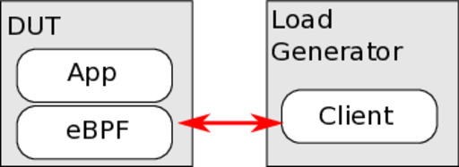

# Artifact Reproducibility Guide

## Experiment Machines and Cloudlab Configurations

Hardware: the experiments were performed on [Cloudlab](https://www.cloudlab.us/) platform using machines from [Utah cluster with type c6525-25g](https://www.utah.cloudlab.us/portal/show-nodetype.php?type=c6525-25g).

We used two directly connected servers for each experiment: one served as the
load generator while the other ran the Beeswax program (Figure 1).



Each server is equipped with an AMD EPYC 7302P 16-Core (Zen 2 – Rome) processor
with 0.5 MB of L1, 8 MB of L2, and 128 MB of LLC; has 128 GB of memory; and a
Mellanox Connect-X5 (MT27800 Family) NICs.


> TODO: make the repository a cloudlab profile

## Installing Dependencies

### Setup DUT (Device Under Test)

> This section assumes that git, make, and build-essential packages are already installed (cloudlab images are like this). Other 3rd-party packages will be installed when following the instructions.


Clone the the repository on DUT machine.

```
git clone https://github.com/bpf-endeavor/bpf_prefetch.git
cd bpf_prefetch
make install_deps
```

The `install_deps` is expect to exit completing its task because the rest of
setup requires a kernel with Beeswax support. Install as follows: 

```
cd ./others/kernel-sw-prefetch
./install.sh
```

By this poinrt, a new kernel should be installed. Reboot the machies to load
the new kernel, and later continue following commands from the root of
`bpf_prefetch/` direcotry:

```
make install_deps # continues from previous step 
make load_kmod
make configure4exp
```

### Setup Workload Generator

> TODO: To be written


## Application Experiment 1: Katran

During setup phase, the script has cloned Katran and applied patches to adopt
Beeswax design. Both the original version and one with Beeswax design is
compiled and are ready for experimentation.

The `./scripts/katran/run_katran.sh` is the script for launching the load-balancer and preparing it for performance measurement.
The flags for running the script is described below. 

> **Important note:** `OTHER_SERVER_IP` and `DEFAULT_MAC` has to updated in the script based on experiment network configurations.

> TODO: make the script autodiscover these values

```
Usage: run_katran.sh MODE EXP
  MODE: [--baseline | --batch | --bax] which version of Katran to use in experiment
  EXP:  [--id-routing | --lru-routing ] select experiment configuration
```

To repeat the experiment in Figure 5 (exploring katran with different workloads
and memory footprint), there is a helper script:
`./script/katran/workload_analysis_scripts/katran_explore_flows.sh`.
This scripts runs on the workload generator machine, but using `SSH`, it will
also connect to DUT and run `run_katran.sh` script with correct flags.

> **Important note:** There are some IP address and MAC address that needs to be configured in the script in order to correctly work

> TODO: make the script autodiscover these values

The script will gather raw data and store them at `RESULT_DIR=~/results/`. For analysing the result you can use the 
`./script/katran/workload_analysis_scripts/clean_exp_results.py`


## Application Experiment 2: BMC

> TODO: To be written
