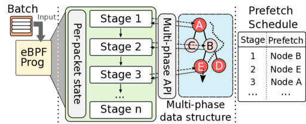

# Beeswax: A Study in eBPF Runtime Support for Cache Efficiency

This is repository presents **Beeswax**: our prototype for
answering how one can address the cache-miss challenges faced by the eBPF
programs, especially when their memory working size (e.g., number of entries in
the MAPs) is large. The full discussion of motivating examples and trade-offs
of the solution can be found in our paper
["Don't Stall Me Now: Hiding Memory Latency in eBPF"](https://fshahinfar1.github.io/papers/dont_stall_me_now_hiding_memory_latency_in_ebpf.pdf)
which is presented at the ACM SIGCOMM 2026 (Denver USA).
The recorded video of the presentation is [available on SIGCOMM's YouTube channel](https://youtu.be/7E7xA2gXxK8?si=YHa84nJ9lW_WInKN&t=104).

Our solution requires few new runtime features:

1. Support for CPU prefetch instructions
2. Support for batch event processing

A modified version of kernel with these supports is available [here](https://github.com/bpf-endeavor/kernel-sw-prefetch).
We then describe a recipe to use these features along with eBPF [Arena MAP](https://fshahinfar1.github.io/blog/04_ebpf_arena/build/blog.html)
to implement more efficient eBPF programs. 

**You can contact `farbod.shahinfar [at] polimi .it` for your questions.**

## About

This repository is meant as the accompanying artifact of our paper and we share
required material to understand the details of the system and experiments performed.
This includes code for programs used in experiments, and scripts for preparing
and setting up the experiment environment. **The step-by-step guide for
reproducing the artifact is found [ARTIFACT.md](./ARTIFACT.md)**

The repository is structured as below:

```
.
├── Makefile # Used for preparing experiment environment
├── docs # The result of experiments and scripts to plot them are here
├── motivation # Some microbenchmarks
├── libs
│   ├── arena-ds # Some data structures implemented using eBPF Arena feature
│   ├── bax # The library and syntax extension for Beeswax
│   ├── honey # Some eBPF library
│   └── kfuncs # Some kernel modules that expose kfuncs needed for eBPF/Beeswax
├── patches # Patches to enable Beeswax support in applications used in evaluation 
└── scripts # Scripts for setting up environment and running experiments
    ├── katran # Scripts for repeating Katran experiment (Figure 5 of paper)
    ├── bmc # Scripts for repeating BMC (in-kernel key-value store) experiment (Figure 6 of paper)
    ├── install_scripts # Scripts for installing dependencies
    ...
│
├── others/ # The 3rd-party programs and libraries such as libbpf, katran, bmc,
│           # customized-kernel, ... are stored here during build
│
├── config.sh # Fill this file with details of experiment environment such as IP and MAC addresses
...
```

## How Beeswax Works? (System Design)



Beeswax is a recipe for building eBPF programs that can effectively hide memory latency. For this purpose, the programs rely on:

1. Designing data structure API in multiple phases
2. Prefetch instruction
3. Batch processing
4. Arena MAP for implementing the data structures

When number of entries in a MAP gets large, the chance of experiencing
cache-misses on lookup operations increase. The cache-misses happens both when
dereferencing the return value (result of lookup operation) and also when the
lookup is accessing the internal structure (e.g., such as bucket of hash map).

By redesigning the API of data structure, the program can make partial progress,
prefetch the memory address that may miss in cache, and switch to an
independent task for some time and come back to unfinished operation and
perform other phases of the operation.

By pairing this idea with batch processing Beeswax programs are organized in
multiple stages in which independant packets each make partial progress when
accessing MAPs (for example performing the first phase). The time between each
stage will allow the CPU to bring data into the cache, and when the program
continues with the next phase of operations it will not experience cache-miss.

### Programming Model

A Beeswax program is capable of processing events in batches. As a starting point, we have extended the XDP hook to support batch packet processing (supporting mlx5 and virtio drivers).
Below you can see a simple Beeswax program and layout of its context object. The batch processing programs start with `bbb_` prefix and receive `struct xdp_batch_md *` as context object.

```
SEC("xdp")
int bbb_test_main(struct xdp_batch_md *batch)
{
    // This defines a scope in which Beeswax specific API is usable
    BAX_PROG_BEGIN();

    // batch_size a keyword 
    bpf_printk("batch size: %d", batch_size);

    // ...
    return 0;
}
```

The context object (`batch` in the example above) contains a fixed size array
of original XDP context objects. The program can directly access the context to
retrieve packet by their index from `buffs` array and write the verdict value
(e.g., `XDP_PASS` or `XDP_DROP`) to actions array at the same index. But, this
approach is hard to program and for this reason Beeswax inclues a library that
provides programming support for batch processing.

```
#define XDP_MAX_BATCH_SIZE 32
struct xdp_batch_md {
    __u32 size;
    __u32 __padding__;
    struct xdp_md buffs[XDP_MAX_BATCH_SIZE];
    __u32 actions[XDP_MAX_BATCH_SIZE];
};
```

More specifically, Beeswax programs are organized in multiple stages in which
packets are processed. Every packet is associated with one. Initially all packet
start from the stage indicated by `BAX_DECLARE_INIT_STAGE_NAME`.

A stage is defined using `BAX_STAGE(name, {...})` syntax. When the control-flow
of program reaches a stage, it runs the code for each packet in the batch that
is marked for that stage.

During each stage, the packet may 1) finish processing (e.g., when dropped), 2)
stay at same stage (when the block of code should be repeated), or 3)
transition to another stage (using `BAX_NEXT_STAGE(name of next stage)`). 

```
...
BAX_DECLARE_INIT_STAGE_NAME(FIRST);

SEC("xdp")
int bbb_test_main(struct xdp_batch_md *batch)
{
    __associate_arena();
    BAX_PROG_BEGIN();
    BAX_INIT_BATCH_STATE();
    finished = 0;

    // batch_size a keyword 
    bpf_printk("batch size: %d", batch_size);

    BAX_STAGE(FIRST, `{
        /* data is a keyword which is a pointer to the beginning of the packet */
        struct ethhdr *eth = data; 
        struct iphdr *ip = (void *)(eth+1);
        struct udphdr *udp = (void *)(ip + 1);
        /* query is inside the UDP payload */
        __u32 *r = (__u32 *)(udp + 1);
        if ((void *)(r + 1) > data_end) {
            PASS(); /* packet is too small for our program */
        }
        __u16 tmp_port = bpf_ntohs(udp->dest);
        if (!(tmp_port >= 8000 && tmp_port < 8128)) {
            PASS();
        }

        // ...
         BAX_NEXT_STAGE(CHECK_IN_MAP);
    }')

    // another stage in which some packets are processed
    BAX_STAGE(CHECK_IN_MAP, `{...}`)

    // rest of the program ...
    return 0;
}
```

Each stage is unrolled to run on packets that are marked to belong for that
stage. To make writing programs easier there are special keywords (some are
shown in table below) that are valid in this context and simplify referencing
different data.

| Keyword | Purpose |
|:--------|:--------|
|`pkt`| Pointer to the XDP context |
|`pstate`| Pointer to the packet state (explained next) |
|`data`| Pointer to the beginning of packet buffer |
|`data_end`| Pointer to the end of packet buffer |

When decomposing a program into multiple stages it is common to need to keep
some state between stages. Beeswax simplify this task. The programmer can
define `pkt_state_t` type to declare this information. Then the `pstate`
keyword will point to the state of current packet at each stage.

```
typedef struct {
    int phase[0]; /* the phase is mandatory */
    int key;
    struct dat_partial_lookup_state partial_state; /* dat parital lookup state */
    my_value_t __arena *val;
} pkt_state_t;
```


### KFuncs Used

Some of the experiments rely on external kfuncs. Use `make load_kmod` to load
the kernel modules.

	1. [libs/kfuncs/my\_memcpy](libs/kfuncs/my_memcpy): some standard string and memory operations
	2. [others/arena\_kmod/kmod](others/arena_kmod/kmod): a dummy kfunc to register Arena map with XDP programs


## Citation
 
 To cite the work use following format:

**Bibtex:**

```
@inproceedings{beeswax,
title={Don't Stall Me Now: Hiding Memory Latency in eBPF},
author={Shahinfar, Farbod and Molè, Marco and Panda, Aurojit and Antichi, Gianni},
year={2026},
booktitle={Special Interest Group on Data Communication (SIGCOMM)},
publisher={ACM}
}
```

**Text:**

> Farbod Shahinfar, Marco Molè, Aurojit Panda, and Gianni Antichi. 2026. Don't Stall Me Now: Hiding Memory Latency in eBPF. In Proceedings of the ACM Special Interest Group on Data Communication (SIGCOMM).

